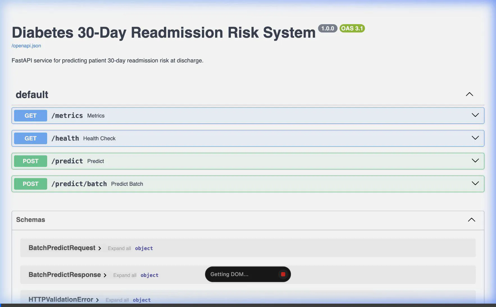
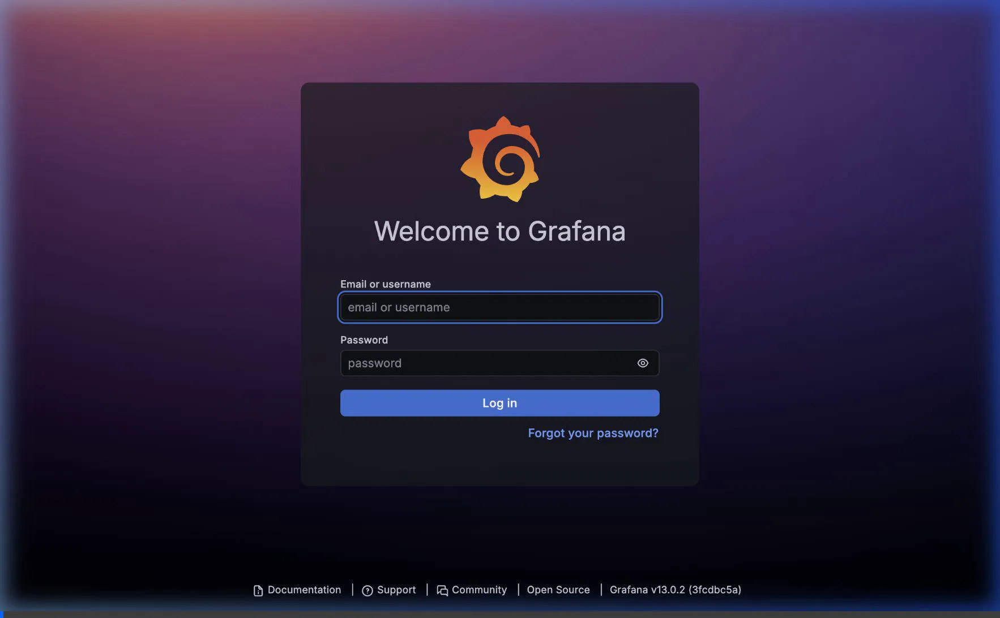
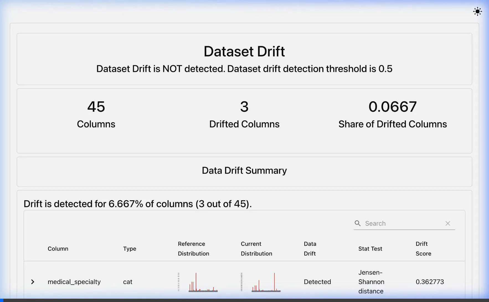

# Diabetes 30-Day Readmission Risk System

### 🚀 Live Cloud API: [https://diabetes-readmission-risk.onrender.com](https://diabetes-readmission-risk.onrender.com)
* (Use `/docs` for the interactive Swagger UI or `/health` for the service status check).

This repository implements a production-grade machine learning system to predict 30-day readmission risk for diabetic patients at discharge. The system features a Metaflow training pipeline, local MLflow registry tracking, a FastAPI inference service, containerized Prometheus/Grafana monitoring, data drift checks using Evidently, and automated retraining.

## Project Structure
```
├── README.md
├── .gitignore
├── requirements.txt
├── Dockerfile
├── docker-compose.yml
│
├── data/
│   ├── raw/                           # Raw patient encounter datasets
│   └── processed/                     # Pre-split parquet partitions & profiles
│
├── artifacts/                         # Preprocessing artifact exports (.joblib)
│
├── src/
│   ├── data/
│   │   ├── profile.py                 # Data profiling script
│   │   └── synthetic/
│   │       ├── generate_drifted_batch.py
│   │       └── generate_labelled_outcomes.py
│   │
│   ├── pipeline/
│   │   ├── readmission_flow.py        # Metaflow training pipeline DAG
│   │   ├── preprocessing.py           # Preprocessing & derived features
│   │   ├── icd9_mapping.py            # ICD-9 Diagnostic category classifier
│   │   └── models/
│   │       ├── registry.py            # Hyperparameter search definitions
│   │       ├── train_eval.py          # Model training, MLflow logging, evaluation
│   │       └── champion_challenger.py # Champion-challenger model registry promotion
│   │
│   ├── explain/
│   │   └── shap_explainer.py          # Global & local SHAP explanations
│   │
│   ├── fairness/
│   │   └── audit.py                   # Fairness disparity audit (Fairlearn)
│   │
│   └── service/
│       ├── main.py                    # FastAPI service entrypoint
│       ├── schemas.py                 # Request and response schemas
│       ├── inference.py               # Resource loader and prediction engine
│       ├── logging_middleware.py      # Structuring local JSON predictions log
│       └── monitoring.py              # Prometheus metrics configuration
│
├── monitoring/
│   ├── prometheus.yml                 # Prometheus target configurations
│   ├── grafana/dashboards/            # Grafana metrics dashboard definitions
│   ├── drift_check.py                 # Evidently data drift check
│   ├── performance_check.py           # Recall performance metric checks
│   ├── alerts.py                      # Alerting dispatcher (Console/Webhook)
│   └── retrain_flow.py                # Metaflow retraining watcher flow
│
├── governance/
│   ├── model_card.md                  # Intended use, performance metrics, limitations
│   ├── fairness_report.md             # Disparity report by age, gender, race
│   ├── reflection.md                  # cost-benefit analysis and post-mortem
│   └── audit_log.jsonl                # Active prediction audit logs
│
└── tests/                             # Pytest unit & integration test files
```

---

## Model Governance & System Validation

This project enforces strict clinical model validation and audit practices:

* **[Model Card (Intended Use, Evaluation & Limitations)](./governance/model_card.md)**: Documents the model's target application, training data characteristics, out-of-sample performance metrics (PR-AUC, Brier score), and operational guardrails.
* **[Fairness Disparity Audit](./governance/fairness_report.md)**: Details the automated demographic parity and equal opportunity checks across sensitive attributes (Age, Gender, and Race) to ensure unbiased prediction behaviors.
* **[Reflection and Cost-Benefit Analysis](./governance/reflection.md)**: Analyzes the business case, clinical trade-offs of the savings-optimized decision threshold, and engineering post-mortem reflections.

---

## Getting Started

### 1. Environment & Dependencies Setup
Create a Python virtual environment and install the required dependencies:
```bash
python3 -m venv .venv
source .venv/bin/activate
pip install --upgrade pip
pip install -r requirements.txt
```

### 2. Copy Dataset and Run Data Profiling
Verify the dataset files `diabetic_data.csv` and `IDS_mapping.csv` are in the `data/raw/` directory, then generate the initial profiling report:
```bash
mkdir -p data/raw
# Copy raw dataset to data/raw/
python src/data/profile.py
```
*This saves a dataset profiling report to `data/processed/data_profile.json`.*

### 3. Run Metaflow Training Pipeline
Train the models (Logistic Regression, Random Forest, and LightGBM), run Stratified CV grid search, evaluate on test, and register the model to MLflow:
```bash
PYTHONPATH=src:src/pipeline:src/pipeline/models python src/pipeline/readmission_flow.py run
```
*After the flow successfully completes, the best model is registered. Take note of the printed Run ID.*

### 4. Promote Champion Model
Promote the trained model to `Production` stage in the MLflow Model Registry using its run ID:
```bash
PYTHONPATH=src:src/pipeline:src/pipeline/models python -c "from champion_challenger import compare_and_promote; compare_and_promote('YOUR_RUN_ID')"
```

### 5. Launch Inference Service & Monitoring (Docker Compose)
Start the FastAPI server, Prometheus scraper, Grafana dashboard, and MLflow tracking server:
```bash
docker compose up --build
```
- **FastAPI API**: http://localhost:8000
- **MLflow Server**: http://localhost:5000
- **Prometheus**: http://localhost:9090
- **Grafana**: http://localhost:3000 (username: `admin`, password: `admin`)

#### Test the API Endpoint
Make an online prediction request using `curl`:
```bash
curl -X POST http://localhost:8000/predict \
  -H "Content-Type: application/json" \
  -d '{
    "race": "Caucasian",
    "gender": "Female",
    "age": "[50-60)",
    "time_in_hospital": 3,
    "num_lab_procedures": 40,
    "diag_1": "250.01",
    "insulin": "Steady"
  }'
```

### 6. Run Monitoring & retraining Watch Flow
Generate synthetic drifted batches and labeled outcomes:
```bash
PYTHONPATH=src python src/data/synthetic/generate_drifted_batch.py --shift severe
PYTHONPATH=src python src/data/synthetic/generate_labelled_outcomes.py --decay-rate 0.3
```
Execute the retraining watch flow to monitor drift and recall floor metrics:
```bash
PYTHONPATH=src:src/pipeline:src/pipeline/models:monitoring python monitoring/retrain_flow.py run
```
*If a drift or recall alarm is triggered, the watch flow automatically starts a retraining run and initiates champion-challenger checks.*

### 7. Run Unit Tests
Verify all preprocessing transforms, ICD-9 mappings, and mock API endpoints:
```bash
PYTHONPATH=src:src/pipeline:src/pipeline/models pytest tests/
```

---

## System Demonstrations

Below are recordings of the system components and dashboards in action.

### 1. FastAPI Predict & Predict Batch Endpoints
This recording demonstrates using the OpenAPI Swagger UI to make real-time single and batch prediction requests:


### 2. Grafana Performance Monitoring Dashboard
This recording shows the Prometheus-scraped metrics, including HTTP Request Rate, Latency, Error Rate, and Predicted Risk Score Distribution:


### 3. Evidently Data Drift Analysis Report
This recording shows the interactive Evidently HTML report comparing the current drifted patient cohort against the reference training dataset:



